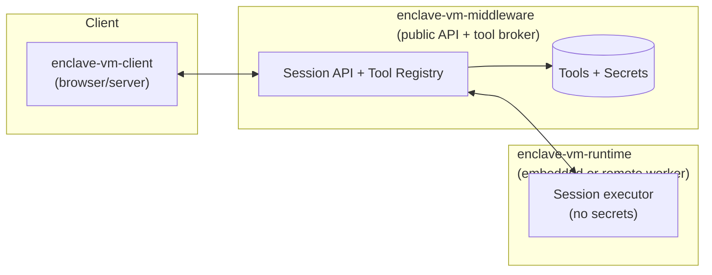
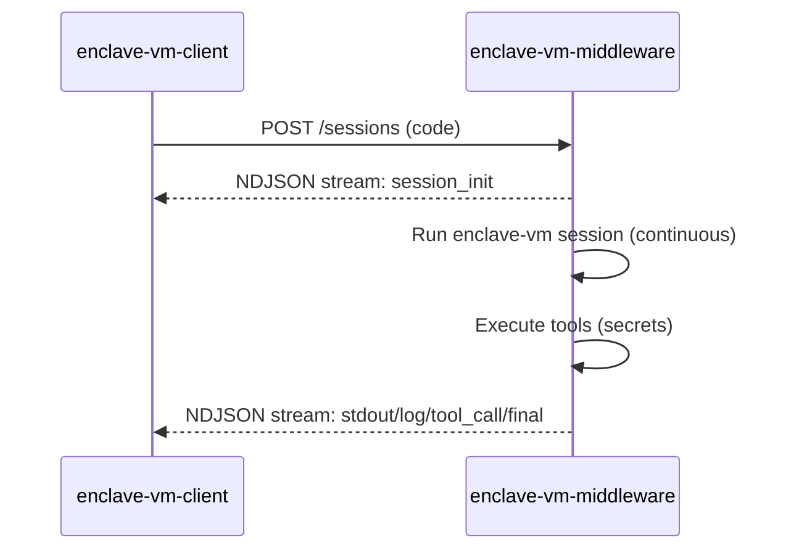
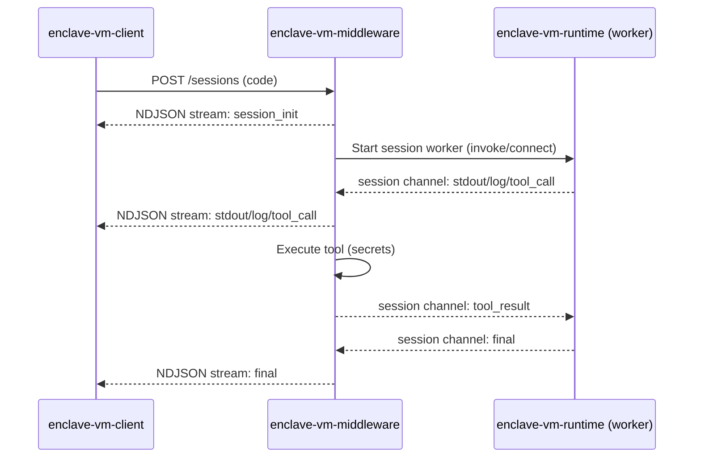
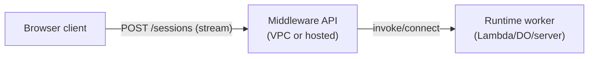
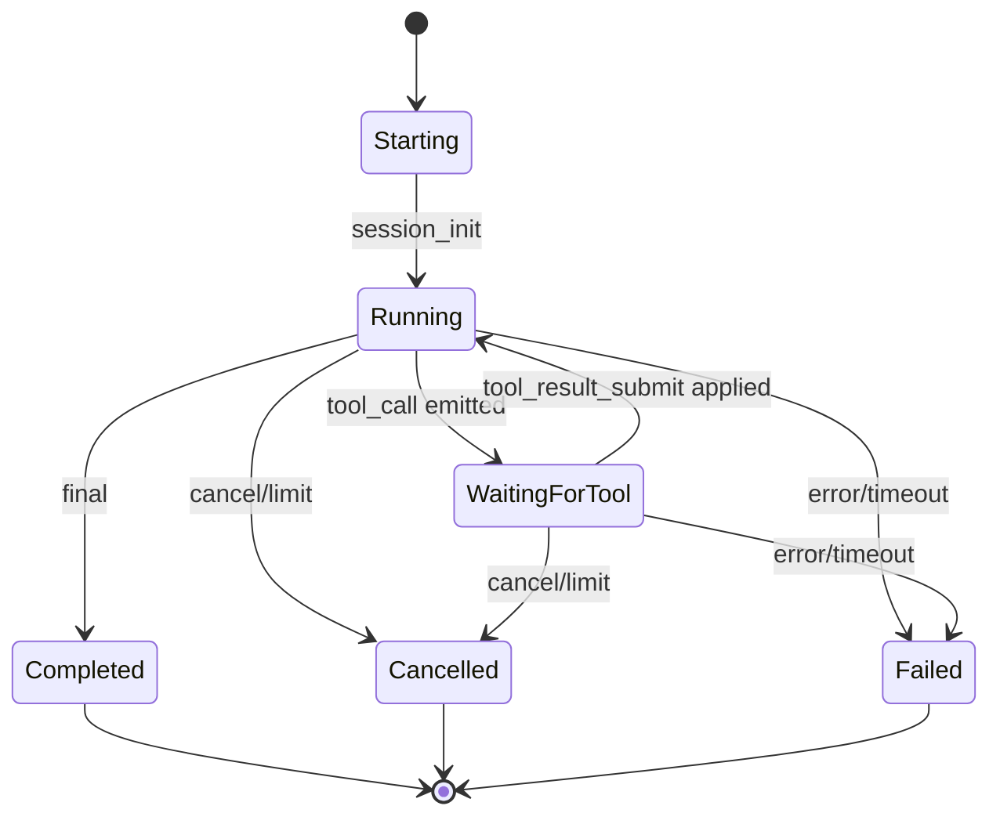
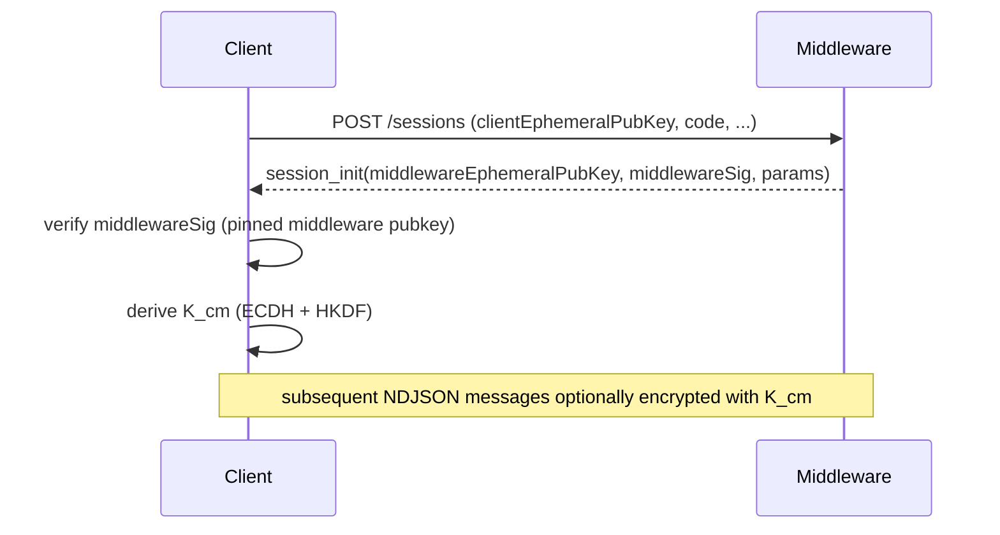

# Enclave VM Streaming Runtime — Architecture (planned)

This document captures the architecture and decisions for turning `libs/enclave-vm` into a **remote, continuous, streaming runtime** that supports `callTool()` roundtrips without requiring developers to run their own VPC runtime.

The design intentionally supports:

- **Browser + server clients on day 1**
- **Continuous sessions** (not “resume per request”)
- **Streaming output** + **tool calls** + **tool results**
- **Optional authenticated per-session encryption** (to prevent MITM/proxy visibility)
- **Reference sidecar + auto-ref** to avoid moving large/sensitive payloads through the runtime when not needed

Status: design/roadmap document (not fully implemented yet). It’s intended to be specific enough to build against.

## Table of contents

1. Goals & Non‑Goals
2. Glossary
3. High-Level Architecture
4. Why “continuous sessions” implies statefulness
5. Session API
6. Stream Protocol
7. Tool calls
8. Reference Sidecar + auto-ref
9. Security
10. Platform notes
11. Open questions

---

## 1) Goals & Non‑Goals

### Goals

- Provide a “managed executor” for AgentScript:
  - client sends code
  - runtime executes continuously and streams events
  - runtime can request tool execution (`tool_call`) and continue once it receives `tool_result`
- Support two deployment modes:
  - **Embedded runtime**: the middleware runs `libs/enclave-vm` directly (single app / VPC).
  - **Extracted runtime**: the middleware launches/connects to an external runtime worker (Lambda/edge/server) and proxies streaming + tool calls.
- Keep secrets and tool execution in the middleware/tool-broker by default (the runtime worker should not have secrets).
- Keep tool contracts safe and explicit via **zod input/output schemas**.
- Reduce throughput and prevent accidental leakage by supporting **reference sidecar** and **AST-based auto-ref**.

### Non‑Goals (for this phase)

- Running a truly continuous VM inside generic “stateless” platforms that do not provide session stickiness (e.g., pure serverless invocations).
- Preventing the runtime host/provider itself from seeing plaintext (that would require TEEs / enclaves and different threat assumptions).

---

## 2) Glossary

- **Runtime**: the component that runs AgentScript continuously (built on `libs/enclave-vm`).
- **Client**: JS SDK used from browser/server to start a session with the middleware and consume the streamed events/results.
- **Middleware / Tool Broker**: Node.js service (often inside a VPC) that owns secrets and executes tool calls.
- **Session**: a long-lived, continuous execution context for a single piece of code (plus its stream + tool roundtrips).
- **Tool**: an external action callable from AgentScript via `callTool(name, args)`.
- **Reference Sidecar**: per-session in-memory store of large/sensitive values addressed by `refId`.
- **Auto-ref**: AST-based decision that a tool result is never accessed/manipulated in runtime code, so it should be stored/passed by reference only.

---

## 3) High-Level Architecture

### Components



### End-to-end flows

#### A) Embedded runtime (single app / VPC)



#### B) Extracted runtime (Lambda/edge/server worker) + brokered tools



#### C) Public endpoint (client always connects to middleware)



### Packages (planned)

- `enclave-vm-client`
  - connects to the middleware public API (browser + server)
  - streaming transport (recommended: `fetch()` + NDJSON)
  - stream parser + message validation (zod)
  - helpers to cancel sessions and handle returned refs (if exposed)

- `enclave-vm-middleware`
  - public Session API (client connects here)
  - tool registry with zod I/O validation
  - secret management + policy (what is runtime-readable)
  - per-session in-memory sidecar (for refs, secrets, large values)
  - runtime adapter:
    - embedded (runs `libs/enclave-vm` locally)
    - remote worker (Lambda/edge/server): starts/owns the session channel and proxies events

- `enclave-vm-runtime`
  - extracted executor that runs `libs/enclave-vm` without secrets
  - communicates with middleware over a per-session “session channel”:
    - runtime → middleware: stdout/log/tool_call
    - middleware → runtime: tool_result/cancel
  - deployable as:
    - server/container worker
    - Cloudflare Durable Object actor
    - AWS Lambda worker (bounded by Lambda max duration)

---

## 4) Why “continuous sessions” implies statefulness

If a session must be truly continuous and keep an in-memory sidecar, then all session I/O must reach the same live session host(s).

In this architecture, that typically means:

- **Embedded runtime**: the middleware is the session host (it owns the sidecar and runs `libs/enclave-vm`), so it must be stateful for the session lifetime.
- **Extracted runtime**: the middleware and the runtime worker both hold session state and communicate over a per-session channel; each side must be reachable for the duration.

### What does NOT work by itself

- “Pure” **stateless edge/serverless functions** as the session host:
  - no guarantee the next tool-result/cancel message lands on the same instance
  - no reliable in-memory sidecar across invocations

In those environments, the runtime must either:

- run on a **stateful** host (server/container or Durable Object), or
- use a **single per-session channel** (typically WebSocket) so messages are delivered to the correct live session without relying on load balancer affinity.

### How does the middleware deliver tool results to the right live session?

Because the sidecar and execution are in-memory, the runtime must route inbound messages to the correct live worker/actor:

- **Durable Objects**: route by `sessionId` → the platform delivers all requests to the same object instance.
- **Sticky load balancer**: consistent hashing / cookie affinity so the same `sessionId` lands on the same runtime node.
- **Gateway + session directory**: a gateway looks up `sessionId -> runtimeNode` in a directory store and forwards the request.
- **Single bidirectional session channel (WebSocket)**: avoids instance routing entirely by sending tool calls/results over the same session-bound connection.

Queues / pub-sub systems (including Upstash Pub/Sub) can be useful for decoupling, but they do **not** solve “deliver to the same in-memory edge instance” unless you already have a stable subscriber (a stateful runtime process or DO).

---

## 5) Session API

The middleware API is designed so the **first request starts the session and returns a streamed response**.

### Endpoints (middleware, public)

- `POST /sessions` → starts a session and returns a streaming response
- `POST /sessions/:sessionId/cancel` → cancels the session
- `POST /sessions/:sessionId/input` → optional “user input” channel (if the script needs interactive input)

### Streaming format

Day-1 recommendation: `application/x-ndjson`

- Works well with browser `fetch()` streaming (POST + readable stream)
- Easy framing (1 JSON object per line)
- Easier to encrypt at the message level than SSE

### Internal runtime channel (middleware ↔ runtime)

Tool calls and tool results happen on the middleware ↔ runtime channel.

- Embedded runtime: in-process function calls (no network)
- Extracted runtime (Lambda/edge/server): use either
  - a bidirectional WebSocket session channel (recommended), or
  - a stateful runtime host where middleware can `POST` tool results to the correct session actor

### Example: start a session (NDJSON over streaming POST)

Request:

```http
POST /sessions
content-type: application/json
accept: application/x-ndjson
```

```json
{
  "protocolVersion": 1,
  "code": "const users = await callTool('get_users', {}); return await callTool('process', { users });",
  "limits": { "sessionTtlMs": 60000, "maxToolCalls": 50, "maxStdoutBytes": 262144 },
  "encryption": { "mode": "optional" }
}
```

First lines of the streamed response (NDJSON):

```jsonl
{"protocolVersion":1,"sessionId":"s_...","seq":1,"type":"session_init","payload":{"cancelUrl":"/sessions/s_.../cancel","expiresAt":"...","encryption":{"enabled":false}}}
{"protocolVersion":1,"sessionId":"s_...","seq":2,"type":"log","payload":{"level":"info","message":"session started"}}
{"protocolVersion":1,"sessionId":"s_...","seq":3,"type":"tool_call","payload":{"callId":"c_...","toolName":"get_users","args":{}}}
```

Tool results are executed by the middleware/tool broker and delivered to the runtime over the internal runtime channel (not by the browser client).

---

## 6) Stream Protocol (versioned, zod-validated)

Every message includes:

- `protocolVersion`
- `sessionId`
- `seq` (monotonic sequence number)
- `type`
- `payload` (type-specific)

Core message types:

- `session_init`
- `stdout` / `log`
- `tool_call`
- `final`
- `heartbeat`
- `error`

Tool results are handled by the middleware/tool broker (internally) and may be surfaced for observability:

- `tool_call` (requested)
- `tool_result_applied` (optional ack emitted once the runtime has applied the result)

### Message shapes (TypeScript-ish)

```ts
type ProtocolVersion = 1;

type BaseEvent = {
  protocolVersion: ProtocolVersion;
  sessionId: string;
  seq: number;
};

type StreamEvent =
  | (BaseEvent & {
      type: 'session_init';
      payload: { cancelUrl: string; expiresAt: string; encryption: { enabled: boolean } };
    })
  | (BaseEvent & { type: 'stdout'; payload: { chunk: string } })
  | (BaseEvent & {
      type: 'log';
      payload: { level: 'debug' | 'info' | 'warn' | 'error'; message: string; data?: Record<string, unknown> };
    })
  | (BaseEvent & { type: 'tool_call'; payload: { callId: string; toolName: string; args: unknown } })
  | (BaseEvent & { type: 'tool_result_applied'; payload: { callId: string } })
  | (BaseEvent & {
      type: 'final';
      payload: { ok: boolean; result?: unknown; error?: { message: string; code?: string } };
    })
  | (BaseEvent & { type: 'heartbeat'; payload: { ts: string } })
  | (BaseEvent & { type: 'error'; payload: { message: string; code?: string } });

// Internal (middleware ↔ runtime) messages on the runtime session channel.
type RuntimeChannelMessage =
  | {
      protocolVersion: ProtocolVersion;
      sessionId: string;
      type: 'tool_result_submit';
      payload: { callId: string; ok: boolean; result?: unknown; error?: { message: string; code?: string } };
    }
  | { protocolVersion: ProtocolVersion; sessionId: string; type: 'cancel'; payload: { reason?: string } };
```

### Optional encryption envelope (per hop)

When enabled, each NDJSON line can be an encrypted envelope rather than a plaintext `StreamEvent`:

```ts
type EncEnvelope = {
  protocolVersion: ProtocolVersion;
  sessionId: string;
  seq: number;
  type: 'enc';
  payload: {
    kid: string; // key id for the session hop
    nonceB64: string;
    ciphertextB64: string; // encrypted JSON of the inner event (including its original type/payload)
  };
};
```

---

## 7) Tool calls

Runtime code calls:

```ts
const result = await callTool('toolName', {
  /* args */
});
```

### Tool broker modes

#### Default: middleware-brokered tools

- runtime emits `tool_call` to the middleware over the runtime session channel
- middleware validates args (zod), executes the tool with secrets, validates output (zod)
- middleware sends `tool_result_submit` back to runtime on the same session channel
- middleware may also mirror `tool_call`/`tool_result_applied` events to the client stream for observability

Default recommendation:

- Browser + server clients: connect to middleware; keep secrets/tools in middleware

### Idempotency + ordering (decision)

- `callId` is globally unique within `sessionId`.
- Tool result delivery must be idempotent by `(sessionId, callId)` on the middleware ↔ runtime channel:
  - re-submitting the same result is a no-op
  - re-submitting with a _different_ result is rejected
- Stream `seq` is monotonic and allows clients to:
  - detect gaps/reconnect issues
  - dedupe repeated events

### Runtime execution state machine



---

## 8) Reference Sidecar + auto-ref (key decision)

### The problem

- Tool outputs can be large (throughput) and/or sensitive (secrets/PII).
- Many scripts only pass tool outputs into other tools or return them directly, without reading them in runtime code.

### Decision

- If a tool output is **not accessed or manipulated** by runtime code, it should be handled by **reference**:
  - stored in a per-session in-memory sidecar
  - replaced with a `{ $ref: { id } }` token
  - usable as an input to subsequent `callTool()` calls (ref-preserving)
  - returnable as final output (still by ref)

### Ref token format (wire + JS)

Wire format (JSON):

```json
{ "$ref": { "id": "ref_..." } }
```

JS runtime representation:

- refs must be **opaque** (no implicit stringification)
- refs must be **serializable** (so they can be passed back into `callTool()` args)

### Sidecar ownership (where the data lives)

Because the sidecar is in-memory and per-session, the owner must be the component that:

1. is allowed to see plaintext, and
2. is sticky for the lifetime of the session.

Typical placements:

- **Brokered tools (default)**: sidecar lives in the **middleware/tool broker**.
  - runtime sees only refs unless a tool is explicitly `runtimeReadable`.
- **Embedded runtime**: sidecar lives in the middleware process (runtime and broker are the same host).
- **Runtime-owned sidecar (rare)**: only for data that is safe for runtime to see (non-sensitive) and when the runtime itself is the tool executor.

### Returning refs (and resolving them)

Decision: tool outputs that are not accessed in runtime code are auto-ref’d **even if they are returned**.

This implies the consumer must resolve refs somewhere:

- The client always connects to the middleware, so middleware can either:
  - resolve refs before sending the final result to the client (opt-in/size/policy based), or
  - return refs and expose `POST /refs/resolve` (authorized) for explicit resolution.

If the sidecar is not reachable, returned refs remain opaque handles (by design).

### Auto-ref via AST (conservative)

We add an AST pass that classifies each `await callTool(...)` result as either:

- **materialize**: runtime needs a real JS value (because the code accesses/manipulates it)
- **ref**: runtime never accesses/manipulates it; keep by reference

“Access/manipulate” includes (non-exhaustive):

- property/index access (`x.id`, `x[0]`)
- destructuring/spread (`{...x}`, `[...x]`, `const {a}=x`)
- calling methods (`x.map(...)`, `x.toString()`)
- iteration (`for..of x`)
- comparisons/branching based on value
- string concatenation / template interpolation
- logging/serialization (`console.log(x)`, `JSON.stringify(x)`)

If any access/manipulation is detected, we must materialize so normal JS works:

```ts
const users = await callTool('get_users', {});
return users.map((u) => u.id);
```

If only pass-through occurs, we auto-ref:

```ts
const users = await callTool('get_users', {});
return await callTool('process_users', { users });
```

Transforms to (conceptually):

```ts
const users = await callTool.ref('get_users', {});
return await callTool('process_users', { users });
```

### AST auto-ref decision procedure (pragmatic)

This is intentionally conservative: if we are not sure, we materialize.

For each `await callTool(...)` expression:

1. Identify the binding(s) that receive the result (identifier, destructuring, inline use).
2. Track all uses in the same function scope (def-use).
3. If _any_ use is “access/manipulate”, classify as **materialize**.
4. Otherwise, if all uses are limited to:
   - being embedded into an object/array that is itself passed into another `callTool(...)`, or
   - being returned (directly or inside an object/array),
     classify as **ref**.

In other words: “pass-through only” → ref; “read it” → materialize.

### Sensitivity enforcement

Refs can be tagged by the tool broker/middleware:

- `runtimeReadable: true` → runtime may receive materialized value (when needed)
- `runtimeReadable: false` → runtime must never dereference; attempts should fail fast

The combination of **auto-ref** and **runtimeReadable** provides:

- throughput reduction
- reduced accidental data exposure
- policy enforcement for secrets/PII

### Redaction pattern (PII/secrets never enter runtime)

When middleware is the tool broker, it can redact sensitive fields by replacing them with refs that only the broker can resolve.

Example: a login tool should not expose the password to runtime code.

1. Runtime requests login:

```json
{ "toolName": "login", "args": { "username": "alice", "password": { "$ref": { "id": "ref_pw_..." } } } }
```

2. Middleware resolves `ref_pw_...` from the per-session sidecar, executes the real login call using the plaintext password, and returns a safe result (e.g., an access token ref, or a short-lived token value depending on policy).

This lets scripts chain credentials through tools without ever observing the secret values in runtime code.

---

## 9) Security: authentication + optional per-session encryption

### Baseline

- Always use TLS (`https`/`wss`)
- Authenticate session creation (API key / JWT / signed request)
- Enforce session limits (duration, output bytes, tool calls, etc.)

### Authorization model (decision)

- `sessionId` is not a secret; treat it as a routing key.
- Every endpoint that mutates/observes session state (session stream, `/cancel`, optional `/input`, optional ref resolution) requires authorization:
  - caller identity (API key/JWT) and/or
  - a short-lived per-session token minted at session creation
- The middleware ↔ runtime session channel is scoped to a single session and must be mutually authenticated (session token and/or pinned keys).

### Optional per-session encryption (to protect against intermediaries)

Decision: if we do “session keys”, the handshake must be **authenticated**; otherwise a MITM can negotiate two different keys and still read everything.

We use a per-hop design:

- Client ↔ Middleware derive `K_cm`
- Middleware ↔ Runtime derive `K_mr`

Each hop uses:

- ephemeral ECDH (browser-compatible curve)
- HKDF → derive symmetric keys
- AES-GCM for message payloads
- sequence numbers + nonces for replay protection

Authentication options (choose one per deployment):

- **Pinned middleware public key** in the client SDK (client always connects to middleware).
- **Pinned runtime public key** in the middleware (middleware authenticates the extracted runtime worker).

### Handshake sketch (client ↔ middleware)

The handshake can be carried inside the first streamed `session_init` event (or a preflight `POST /handshake`), but the important part is:

- client verifies it’s talking to the intended middleware identity
- then derives a per-session symmetric key



The middleware establishes a separate authenticated session channel to the extracted runtime worker (when used) and may encrypt that hop independently.

### Threat model clarity (decision)

- This encryption is to prevent intermediaries (proxies/CDNs/logging layers) from reading/modifying payloads.
- It does not prevent the runtime execution environment (or its operator) from accessing plaintext at the point of execution.

---

## 10) Platform notes (runtime placement)

### Capability matrix (guidance)

| Target                     | Continuous in-memory session                 | Bidirectional channel                | Recommended role                                |
| -------------------------- | -------------------------------------------- | ------------------------------------ | ----------------------------------------------- |
| Cloudflare Durable Objects | Yes (actor per `sessionId`)                  | WebSocket (incl. hibernation)        | Runtime (edge)                                  |
| Server / container (Node)  | Yes (process/worker per session)             | WebSocket or NDJSON+control endpoint | Runtime (universal)                             |
| Vercel Edge / Serverless   | Not reliable for stickiness/continuous state | Don’t rely on inbound WS             | Gateway to stateful runtime                     |
| AWS Lambda                 | Bounded (≤ Lambda max duration)              | Outbound WS/HTTP to middleware       | Extracted runtime worker (short-lived sessions) |

### Cloudflare Workers + Durable Objects (recommended “edge runtime”)

- WebSockets are supported in Workers and Durable Objects.
- Durable Objects provide a per-session “single coordinator” model and can keep per-session state.

### Server/container runtime (recommended “universal runtime”)

- Run a long-lived Node.js service that owns session workers and in-memory sidecars.
- Use WebSockets (bidirectional) or an NDJSON stream + a control endpoint between middleware and runtime.
- Place behind a reverse proxy with sticky routing if you scale horizontally.

### Vercel Edge / Serverless (gateway-only)

- Use these as request routers/proxies that forward to a stateful runtime (server/DO).
- Do not rely on them for in-memory session state or per-session stickiness.

### AWS Lambda (bounded extracted runtime)

- Can host an extracted runtime worker up to the Lambda maximum duration.
- Prefer a single per-session channel to middleware (e.g., outbound WebSocket) so tool results don’t depend on instance stickiness.

---

## 11) Open questions / follow-ups

- Do we standardize on NDJSON first and add WebSocket later, or ship both from day 1?
- Should middleware resolve refs automatically for browser clients (size/policy based), or require explicit `POST /refs/resolve`?
- How do we expose a safe “return refs” UX (auto-resolve vs explicit `resolveRefs()` API)?
- What’s the recommended packaging path for Upstash Marketplace (templates + hosted broker vs hosted runtime)?
