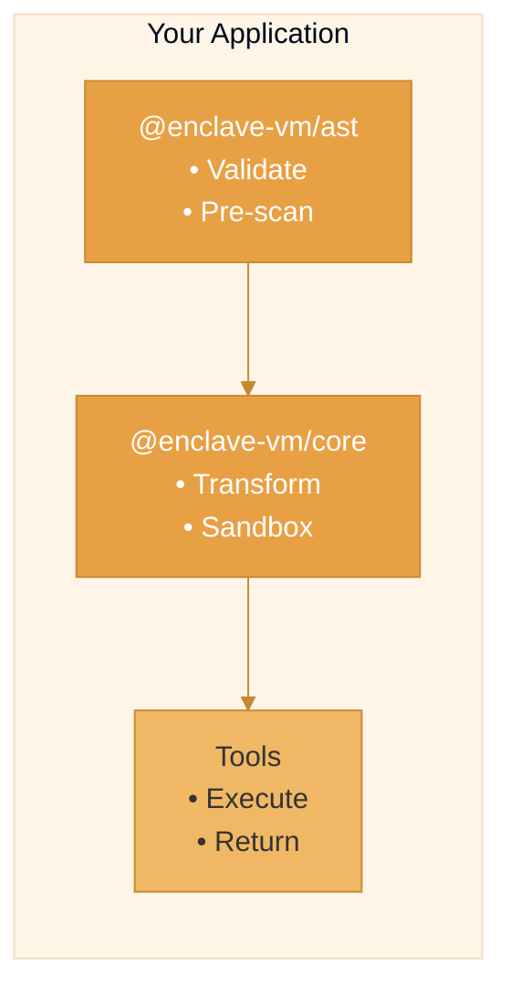
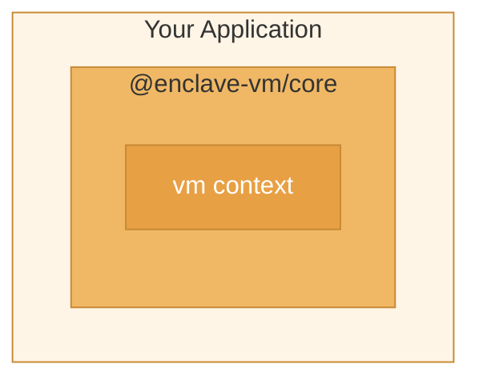
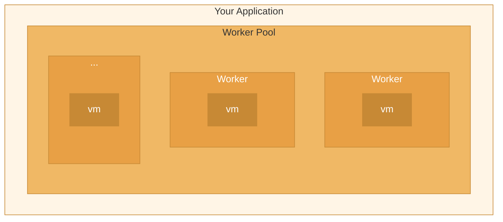
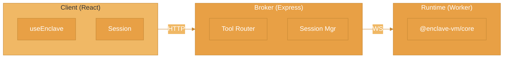
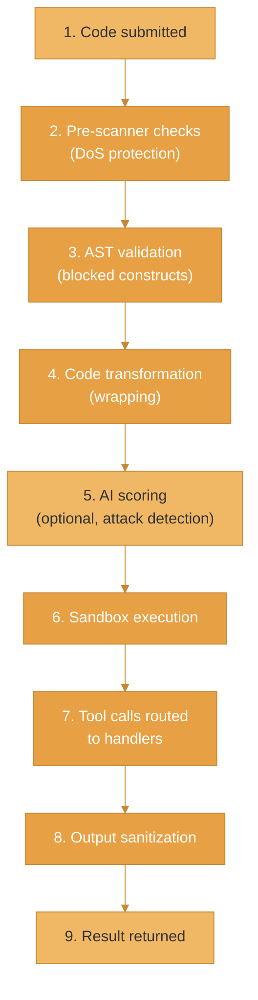
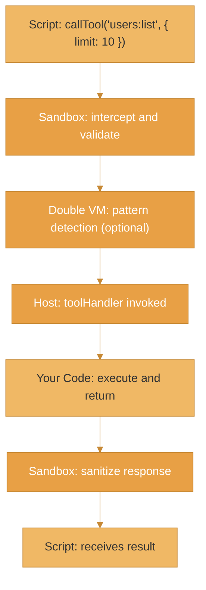

Enclave provides a layered security architecture for executing untrusted JavaScript code. This page explains the system components and how they work together.

## Core Components



### ast-guard

Static analysis and validation layer:
- **Pre-scanner** - Catches DoS attacks before parsing
- **AST validation** - Blocks dangerous constructs
- **Code transformation** - Wraps code for safe execution

### enclave-vm

Runtime execution layer:
- **Sandboxed context** - Isolated JavaScript environment
- **Resource limits** - Timeout, iteration, memory limits
- **Tool routing** - Controlled external interactions

### Tools

Your application's capabilities exposed to scripts:
- **Type-safe handlers** - Validate inputs, sanitize outputs
- **Rate limiting** - Control how often tools are called
- **Audit logging** - Track all tool invocations

## Defense-in-Depth Layers

Enclave uses a 6-layer security model:

| Layer | Component | Purpose |
|-------|-----------|---------|
| 0 | Pre-Scanner | Catch DoS before parsing |
| 1 | AST Validation | Block dangerous syntax |
| 2 | Code Transform | Wrap in safe runtime |
| 3 | AI Scoring Gate | Detect attack patterns |
| 4 | Runtime Sandbox | Isolate execution |
| 5 | Output Sanitization | Clean return values |

Each layer provides independent protection. Even if one layer is bypassed, subsequent layers catch the attack.

## Deployment Architectures

### Single Process (Embedded)

Simplest deployment - everything runs in one process:



```ts
import { Enclave } from '@enclave-vm/core';

const enclave = new Enclave({
  toolHandler: async (name, args) => executeLocalTool(name, args),
});
```

**Best for:** Internal tools, low traffic, simplicity.

### Worker Pool (Process Isolation)

Code runs in separate worker threads for stronger isolation:



```ts
import { Enclave } from '@enclave-vm/core';

const enclave = new Enclave({
  adapter: 'worker_threads',
  workerPoolConfig: {
    minWorkers: 2,
    maxWorkers: 8,
    memoryLimitPerWorker: 256 * 1024 * 1024,
  },
});
```

**Best for:** Multi-tenant applications, untrusted code, memory isolation.

### Distributed (3-Tier with EnclaveJS)

For production applications with streaming and real-time features:



- **Client** - React hooks for real-time streaming UI
- **Broker** - HTTP API, tool registry, session management
- **Runtime** - Isolated code execution worker

```ts
// Broker
import { createBroker } from '@enclave-vm/broker';

const broker = createBroker({
  mode: 'extracted',
  runtimeUrl: 'ws://runtime:3001',
});

broker.tool('users:list', {
  handler: async () => db.users.findAll(),
});
```

**Best for:** Production SaaS, real-time UIs, horizontal scaling.

## Data Flow

### Request Flow



### Tool Call Flow



## When to Use Each Architecture

| Scenario | Recommended Architecture |
|----------|--------------------------|
| Prototyping | Single Process |
| Internal tools | Single Process |
| User scripts (single tenant) | Worker Pool |
| Multi-tenant SaaS | Worker Pool or Distributed |
| Real-time UI with streaming | Distributed |
| Edge/serverless deployment | Distributed (Runtime as Lambda) |

## Related

- [Security Model](/concepts/security-model) - 6-layer defense explained
- [AgentScript](/concepts/agentscript) - Language subset definition
- [enclave-vm](/core-libraries/enclave-vm/overview) - Core library documentation
- [EnclaveJS](/enclavejs/overview) - Streaming runtime
