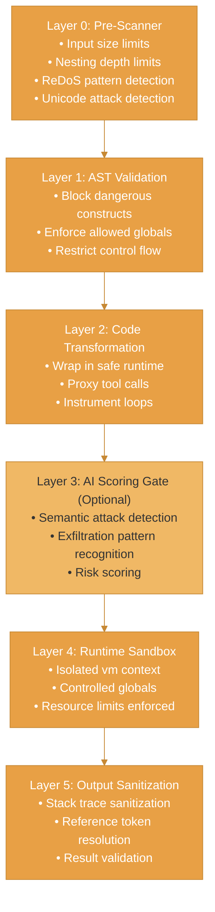

Enclave uses a defense-in-depth approach with 6 independent security layers. Each layer provides protection even if other layers are bypassed.

## The 6 Layers



## Layer 0: Pre-Scanner

Runs BEFORE parsing to catch DoS attacks that could crash the parser:

| Check | Limit | Purpose |
|-------|-------|---------|
| Input size | 100MB max | Memory exhaustion |
| Line length | 100K chars | Minified code bombs |
| Nesting depth | 200 levels | Stack overflow |
| String literals | 5MB each | Embedded data attacks |
| Regex patterns | 1K chars | ReDoS prevention |

Pre-scanner also detects:
- **BiDi attacks** (Trojan Source CVE-2021-42574)
- **Invisible characters** (zero-width spaces, etc.)
- **Homoglyph attacks** (lookalike characters)

## Layer 1: AST Validation

Static analysis of the parsed AST to block dangerous patterns:

### Blocked Categories

| Category | Examples | Risk |
|----------|----------|------|
| Code execution | `eval`, `Function`, `setTimeout(string)` | Arbitrary code injection |
| System access | `process`, `require`, `import` | Host system access |
| Globals | `window`, `global`, `globalThis` | Sandbox escape |
| Prototype | `__proto__`, `constructor` | Prototype pollution |
| Metaprogramming | `Proxy`, `Reflect` | Interception |
| User functions | `function foo(){}` | Recursion bombs |

### Enforcement

```ts
// These are blocked by AST validation:
eval('malicious');           // ❌ eval blocked
new Function('return 1')();  // ❌ Function constructor blocked
process.exit();              // ❌ process access blocked
obj.__proto__.pollute = 1;   // ❌ prototype access blocked
```

## Layer 2: Code Transformation

Valid code is transformed for safe execution:

```ts
// Original code:
const users = await callTool('users:list', {});
for (const user of users) {
  console.log(user.name);
}

// Transformed code:
async function __ag_main() {
  const users = await __safe_callTool('users:list', {});
  for (const user of __safe_forOf(users)) {
    __safe_console.log(user.name);
  }
}
```

Transformations include:
- **Main wrapper** - Entry point for execution
- **Safe callTool** - Proxied through host with counting
- **Safe loops** - Iteration limits enforced
- **Safe console** - Rate-limited with output capture

## Layer 3: AI Scoring Gate

Optional semantic analysis that detects attack patterns beyond static analysis:

| Pattern | Score | Example |
|---------|-------|---------|
| Data exfiltration | 50 | list → send sequence |
| Sensitive field access | 35 | Query for passwords/tokens |
| Excessive limits | 25 | `limit: 1000000` |
| Loop tool calls | 25 | `callTool` inside for loop |
| Dynamic tool names | 20 | Variable as tool name |

```ts
const enclave = new Enclave({
  scoringGate: {
    scorer: 'rule-based',
    blockThreshold: 70,
    warnThreshold: 40,
  },
});
```

## Layer 4: Runtime Sandbox

Code executes in an isolated Node.js vm context:

- **Fresh context** - No access to host scope
- **Controlled globals** - Only whitelisted APIs available
- **Resource limits** - Timeout, iterations, tool calls enforced
- **Optional worker isolation** - OS-level memory separation

### What's Available in the Sandbox

```ts
// Available in sandbox:
Math.random()               // ✓ Safe math
JSON.parse('{"a":1}')       // ✓ JSON handling
[1,2,3].map(x => x * 2)     // ✓ Array methods
await callTool('api', {})   // ✓ Tool calls (proxied)
console.log('debug')        // ✓ Console (rate-limited)

// NOT available:
process.env.SECRET          // ✗ No process access
require('fs')               // ✗ No require
fetch('http://evil.com')    // ✗ No network
```

## Layer 5: Output Sanitization

Results are sanitized before returning to the caller:

- **Stack trace sanitization** - Remove internal paths and sensitive info
- **Reference resolution** - Resolve sidecar tokens to actual data
- **Type validation** - Ensure result is serializable

## Security Level Presets

Enclave provides preset configurations:

| Level | Timeout | Iterations | Tool Calls | Use Case |
|-------|---------|------------|------------|----------|
| STRICT | 5s | 1K | 10 | Untrusted code |
| SECURE | 15s | 5K | 50 | Semi-trusted |
| STANDARD | 30s | 10K | 100 | Internal tools |
| PERMISSIVE | 60s | 100K | 1K | Testing |

## What Enclave Protects Against

- **Code injection** - Blocked by AST validation
- **Infinite loops** - Limited by maxIterations
- **Resource exhaustion** - Limited by timeout and limits
- **Prototype pollution** - Blocked by AST validation
- **Sandbox escape** - Blocked by controlled globals
- **Information leakage** - Stack traces sanitized
- **ReDoS attacks** - Pre-scanner detection
- **Unicode attacks** - BiDi and homoglyph detection

## What Enclave Does NOT Protect Against

- **Tool abuse** - Scripts can call allowed tools; limit what's available
- **Algorithmic complexity** - O(n²) algorithms run within limits
- **Business logic attacks** - Tool-level validation required
- **Side effects** - Tool calls have real effects

## Best Practices

1. **Use STRICT for untrusted code** - AI-generated, user-submitted
2. **Limit available tools** - Only expose what's needed
3. **Validate tool inputs** - Check arguments before execution
4. **Monitor execution** - Log tool calls and durations
5. **Set appropriate limits** - Tune for your use case
6. **Keep updated** - Security improvements in new versions

## Related

- [Architecture](/concepts/architecture) - System overview
- [AgentScript](/concepts/agentscript) - Language definition
- [Security Levels](/core-libraries/enclave-vm/security-levels) - Preset details
