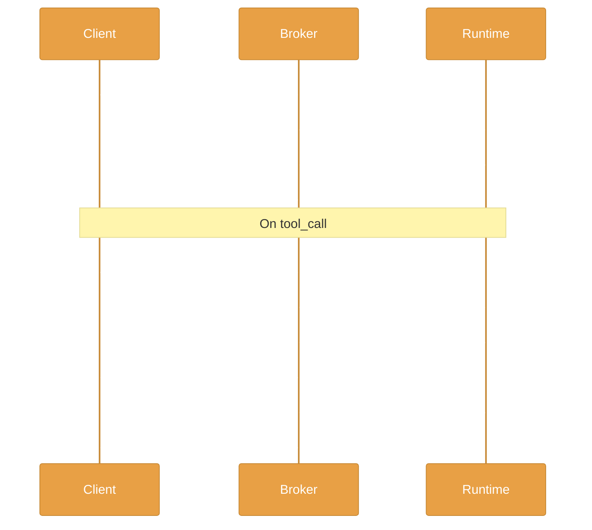
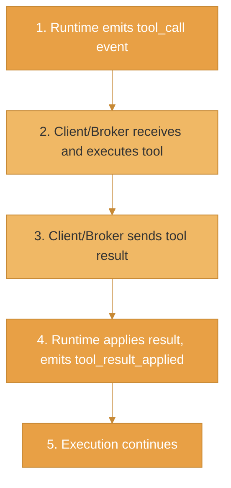

The EnclaveJS streaming protocol enables real-time communication between clients and the execution runtime. It uses NDJSON (Newline Delimited JSON) for efficient streaming with optional end-to-end encryption.

## Protocol Overview



## Event Types

### session_init

Sent when a session starts:

```json
{
  "type": "session_init",
  "sessionId": "sess_abc123",
  "timestamp": 1704067200000,
  "payload": {
    "limits": {
      "maxDurationMs": 30000,
      "maxToolCalls": 100
    }
  }
}
```

### stdout

Captured console output:

```json
{
  "type": "stdout",
  "sessionId": "sess_abc123",
  "timestamp": 1704067200100,
  "payload": {
    "data": "Processing user: Alice\n"
  }
}
```

### log

Structured log messages:

```json
{
  "type": "log",
  "sessionId": "sess_abc123",
  "timestamp": 1704067200150,
  "payload": {
    "level": "info",
    "message": "Tool call completed",
    "data": { "tool": "users:list", "duration": 42 }
  }
}
```

### tool_call

Request for tool execution:

```json
{
  "type": "tool_call",
  "sessionId": "sess_abc123",
  "timestamp": 1704067200200,
  "payload": {
    "callId": "call_xyz789",
    "tool": "users:list",
    "args": { "limit": 10 }
  }
}
```

### tool_result_applied

Confirmation that tool result was applied:

```json
{
  "type": "tool_result_applied",
  "sessionId": "sess_abc123",
  "timestamp": 1704067200300,
  "payload": {
    "callId": "call_xyz789"
  }
}
```

### heartbeat

Keep-alive message:

```json
{
  "type": "heartbeat",
  "sessionId": "sess_abc123",
  "timestamp": 1704067205000,
  "payload": {}
}
```

### final

Session completed:

```json
{
  "type": "final",
  "sessionId": "sess_abc123",
  "timestamp": 1704067210000,
  "payload": {
    "result": { "count": 5, "items": [...] },
    "stats": {
      "duration": 10000,
      "toolCallCount": 3,
      "iterationCount": 15
    }
  }
}
```

### error

Execution error:

```json
{
  "type": "error",
  "sessionId": "sess_abc123",
  "timestamp": 1704067210000,
  "payload": {
    "code": "TIMEOUT",
    "message": "Execution exceeded 30s timeout"
  }
}
```

## NDJSON Format

Events are sent as newline-delimited JSON:

```
{"type":"session_init","sessionId":"sess_abc123",...}\n
{"type":"stdout","sessionId":"sess_abc123",...}\n
{"type":"tool_call","sessionId":"sess_abc123",...}\n
{"type":"final","sessionId":"sess_abc123",...}\n
```

Benefits:
- **Streaming-friendly** - Parse events as they arrive
- **Memory efficient** - No buffering entire response
- **Simple parsing** - Split by newline, parse each line

## Tool Call Flow

When the runtime needs to call a tool:



### Submitting Tool Results

```ts
// Via HTTP (when using broker)
POST /sessions/:sessionId/tool-result
{
  "callId": "call_xyz789",
  "result": { "users": [...] }
}

// Via WebSocket (direct to runtime)
{
  "type": "tool_result",
  "callId": "call_xyz789",
  "result": { "users": [...] }
}
```

## End-to-End Encryption

Optional encryption using ECDH key exchange + AES-256-GCM:

### Key Exchange

```
1. Client generates ECDH key pair (P-256)
2. Client sends ClientHello with public key
3. Server generates ECDH key pair
4. Server sends ServerHello with public key
5. Both derive shared secret
6. Session keys derived via HKDF
```

### Encrypted Events

```json
{
  "encrypted": true,
  "iv": "base64-nonce",
  "ciphertext": "base64-encrypted-event",
  "tag": "base64-auth-tag"
}
```

### Configuration

```ts
const client = new EnclaveClient({
  serverUrl: 'https://broker.example.com',
  encryption: {
    enabled: true,
    curve: 'P-256',
  },
});
```

## Reconnection

The protocol supports reconnection with event replay:

```ts
const client = new EnclaveClient({
  reconnection: {
    enabled: true,
    maxAttempts: 5,
    initialDelayMs: 1000,
    maxDelayMs: 30000,
    backoffMultiplier: 2,
  },
});
```

### Sequence Tracking

Events include sequence numbers for ordering:

```json
{
  "type": "stdout",
  "seq": 42,
  ...
}
```

On reconnection, the client sends the last received sequence number to resume from that point.

## Event Filtering

Filter events to reduce bandwidth:

```ts
// Only receive specific event types
const stream = broker.execute(code, {
  filter: {
    types: ['stdout', 'final', 'error'],
  },
});

// Block noisy events
const stream = broker.execute(code, {
  filter: {
    blockedTypes: ['heartbeat', 'log'],
  },
});
```

## Protocol Constants

| Constant | Value | Description |
|----------|-------|-------------|
| `PROTOCOL_VERSION` | `"1.0"` | Protocol version |
| `HEARTBEAT_INTERVAL` | 5000ms | Time between heartbeats |
| `DEFAULT_TIMEOUT` | 30000ms | Default session timeout |

## Related

- [EnclaveJS Overview](/enclavejs/overview) - Streaming runtime architecture
- [@enclave-vm/types](/enclavejs/types) - Type definitions
- [@enclave-vm/stream](/enclavejs/stream) - Stream utilities
