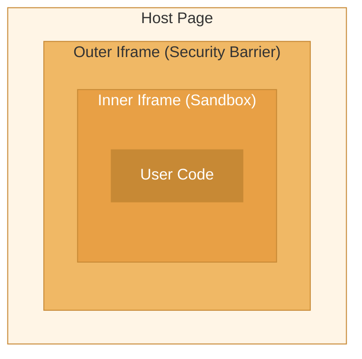
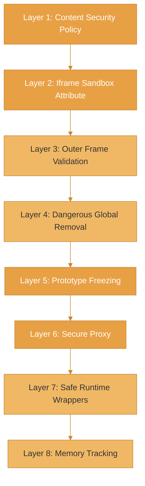
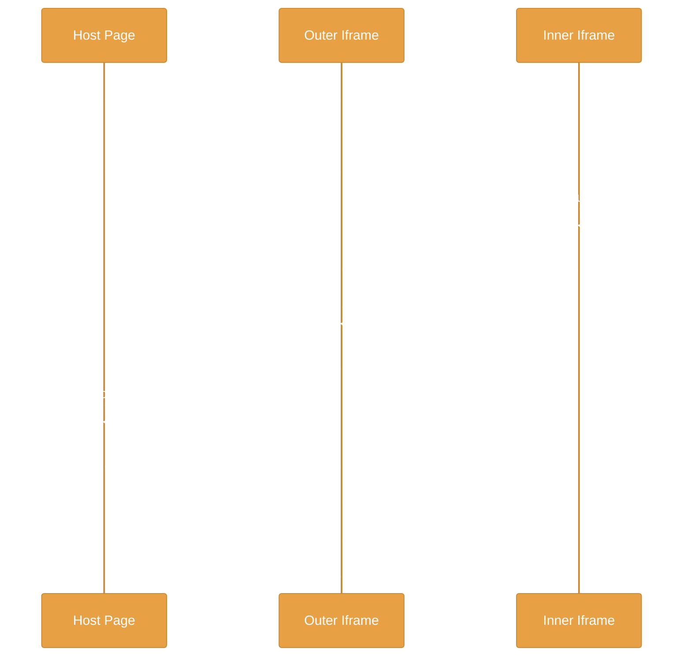

`@enclave-vm/browser` implements defense-in-depth through a double iframe architecture. Each execution creates two nested iframes — an outer security barrier and an inner sandbox — with 8 distinct security layers that work together to prevent sandbox escapes.

## Double Iframe Architecture



- **Host Page**: Your application. Creates the outer iframe and handles tool calls.
- **Outer Iframe**: Security barrier with rate limiting, pattern detection, and name filtering. Relays validated messages between host and inner iframe.
- **Inner Iframe**: The actual sandbox. Contains prototype hardening, secure proxies, safe runtime wrappers, and the user code.

## The 8 Security Layers



### Layer 1: Content Security Policy

Both iframes are created with a strict CSP via `<meta>` tag:

```
default-src 'none'; script-src 'unsafe-inline'; style-src 'unsafe-inline'
```

| Directive | Effect |
|-----------|--------|
| `default-src 'none'` | Blocks all network requests (fetch, XHR, WebSocket, images, fonts) |
| `script-src 'unsafe-inline'` | Allows inline `<script>` but blocks `eval()`, `new Function()`, `setTimeout(string)` |
| No `'unsafe-eval'` | Equivalent to Node.js VM `codeGeneration: { strings: false, wasm: false }` |

### Layer 2: Iframe Sandbox Attribute

Both iframes use a restrictive sandbox attribute:

```
sandbox="allow-scripts"
```

Only `allow-scripts` is enabled. Crucially, `allow-same-origin` is **not** set, which means:
- The iframe cannot access the host page's DOM, cookies, or storage
- The iframe cannot read `parent.document` or `top.document`
- The iframe has a unique `null` origin

### Layer 3: Outer Frame Validation

The outer iframe acts as a security barrier between the host and the inner sandbox. All tool calls from the inner iframe pass through validation:

| Check | Description |
|-------|-------------|
| **Rate limiting** | Max operations per second (default: 100) |
| **Name validation** | Tool names must be non-empty strings |
| **Whitelist pattern** | Optional regex to allow only specific tool names |
| **Blacklist patterns** | Multiple regexes to block specific tool names |
| **Suspicious pattern detection** | Detects multi-step attack sequences (exfiltration, credential theft, etc.) |
| **Rapid enumeration** | Detects the same operation being called repeatedly (default threshold: 30 in 5s) |

### Layer 4: Dangerous Global Removal

Dangerous globals are deleted from the inner iframe's `window` object based on the security level:

| Global | STRICT | SECURE | STANDARD | PERMISSIVE |
|--------|--------|--------|----------|------------|
| `Function`, `eval` | Removed | Removed | Removed | Available |
| `globalThis` | Removed | Removed | Available | Available |
| `Proxy`, `Reflect` | Removed | Removed | Available | Available |
| `SharedArrayBuffer`, `Atomics` | Removed | Removed | Removed | Removed |
| `WebAssembly` | Removed | Removed | Removed | Removed |
| `WeakRef`, `FinalizationRegistry` | Removed | Removed | Removed | Available |
| `ShadowRealm` | Removed | Removed | Removed | Removed |
| `Iterator`, `AsyncIterator` | Removed | Removed | Available | Available |
| `performance`, `Temporal` | Removed | Available | Available | Available |

**Always removed** (all security levels):
`fetch`, `XMLHttpRequest`, `WebSocket`, `EventSource`, `Worker`, `SharedWorker`, `ServiceWorker`, `importScripts`, `localStorage`, `sessionStorage`, `indexedDB`, `caches`, `navigator`, `open`, `close`, `alert`, `confirm`, `prompt`, `document`

### Layer 5: Prototype Freezing

All built-in prototypes are frozen after security patches are applied:

- `Object.prototype`, `Array.prototype`, `Function.prototype`
- `String.prototype`, `Number.prototype`, `Boolean.prototype`
- `Date.prototype`, `Error.prototype`, `Promise.prototype`
- `TypeError.prototype`, `RangeError.prototype`, `SyntaxError.prototype`
- `ReferenceError.prototype`, `URIError.prototype`, `EvalError.prototype`

Legacy accessor methods (`__lookupGetter__`, `__lookupSetter__`, `__defineGetter__`, `__defineSetter__`) are replaced with no-ops on `Object.prototype`. Error prototypes have `__proto__` shadowed to return `null`.

### Layer 6: Secure Proxy

Every global object exposed to user code is wrapped in a `Proxy` that blocks access to dangerous properties:

| Blocked Property | Purpose |
|-----------------|---------|
| `__proto__` | Prevents prototype chain manipulation |
| `prototype` | Prevents constructor prototype access |
| `constructor` | Prevents access to native constructors |
| `__defineGetter__` | Prevents legacy accessor injection |
| `__defineSetter__` | Prevents legacy accessor injection |
| `__lookupGetter__` | Prevents legacy accessor introspection |
| `__lookupSetter__` | Prevents legacy accessor introspection |

The proxy behavior is configurable per security level. At `STRICT` and `SECURE` levels, accessing blocked properties throws an error. At `PERMISSIVE`, it returns `undefined`.

Additionally, dangerous static methods on `Object` are neutralized: `defineProperty`, `defineProperties`, `setPrototypeOf`, `getOwnPropertyDescriptor`, and `getOwnPropertyDescriptors`.

### Layer 7: Safe Runtime Wrappers

User code runs through transformed wrappers that enforce resource limits:

| Wrapper | Purpose |
|---------|---------|
| `callTool(name, args)` | Tool calls with count limits and JSON sanitization |
| `__safe_for` | Traditional for loops with iteration limits |
| `__safe_while` | While loops with iteration limits |
| `__safe_doWhile` | Do-while loops with iteration limits |
| `__safe_forOf` | For-of loops with iteration limits (generator-based) |
| `__safe_concat` | Safe string/number concatenation |
| `__safe_template` | Safe template literal handling |
| `parallel(fns)` | Parallel execution of up to 100 total operations with configurable concurrency (default 10, max 20) |
| `console` | Console relay with call count and byte limits |

All loop wrappers share a global iteration counter and check for abort signals on every iteration.

### Layer 8: Memory Tracking

Memory-intensive operations are patched to track estimated usage:

| Method | Protection |
|--------|-----------|
| `String.prototype.repeat` | Estimates `length * count * 2` bytes before execution |
| `Array.prototype.join` | Estimates total string output before execution |
| `Array.prototype.fill` | Estimates `fillCount * 8` bytes before execution |

When the cumulative tracked memory exceeds `memoryLimit` (default: 1MB), a `RangeError` is thrown.

<Warning>
  Memory tracking in the browser is **estimation-based**. Unlike Node.js where V8 heap statistics provide precise measurements, the browser version tracks only known high-risk operations. It is a defense against obvious memory bombs, not an exact memory budget.
</Warning>

## Message Protocol

All communication between layers uses `postMessage` with validated messages. Every message includes a `__enclave_msg__: true` discriminator and a `requestId` for correlation.



### Message Types

| Direction | Type | Description |
|-----------|------|-------------|
| Inner/Outer to Host | `tool-call` | Tool invocation with `toolName`, `args`, `callId` |
| Host to Inner/Outer | `tool-response` | Tool result or error with `callId` |
| Inner to Host | `result` | Execution result with `success`, `value`/`error`, `stats` |
| Inner to Host | `console` | Console output with `level` and `args` |
| Outer to Host | `ready` | Outer iframe initialized |
| Host to Inner | `abort` | Signal to abort execution |

All messages are validated with Zod schemas. Tool names must match `^[a-zA-Z][a-zA-Z0-9:_-]*$` and be 1–256 characters.

## What's Blocked

| Attack Vector | Protection |
|---------------|-----------|
| Network requests | CSP `default-src 'none'` blocks fetch, XHR, WebSocket |
| `eval` / `new Function` | CSP blocks all forms of code generation from strings |
| DOM access | `document` shadowed; no `allow-same-origin` on sandbox |
| Parent frame access | Sandbox prevents reading `parent.document` or `top.document` |
| Prototype pollution | All prototypes frozen; `__proto__` access blocked by proxy |
| Infinite loops | All loops wrapped with iteration counters and abort checks |
| Tool call flooding | Rate limiting in outer frame + per-execution call limits |
| Data exfiltration | Suspicious pattern detection in outer frame |
| Memory bombs | String/Array operation tracking with configurable limits |
| Storage access | `localStorage`, `sessionStorage`, `indexedDB`, `caches` removed |

## What's Available

Sandboxed code has access to a safe subset of JavaScript:

```ts
// Standard operations
const arr = [1, 2, 3, 4, 5];
const doubled = arr.map(x => x * 2);
const sum = doubled.reduce((a, b) => a + b, 0);

// Tool calls
const users = await callTool('users:list', { limit: 10 });
const filtered = users.filter(u => u.active);

// Parallel execution
const [posts, comments] = await parallel([
  () => callTool('posts:list', {}),
  () => callTool('comments:list', {}),
]);

// Console output (relayed to host)
console.log('Found', filtered.length, 'active users');

// Standard globals
const now = new Date();
const pattern = new RegExp('^test');
const encoded = JSON.stringify({ result: sum });

// Math operations
const random = Math.floor(Math.random() * 100);
```

## Related

- [Overview](/core-libraries/enclave-browser/overview) - Getting started with browser enclave
- [Configuration](/core-libraries/enclave-browser/configuration) - All configuration options
- [Double VM Layer](/core-libraries/enclave-vm/double-vm) - Node.js equivalent architecture
- [Security Levels](/core-libraries/enclave-vm/security-levels) - Security preset details
