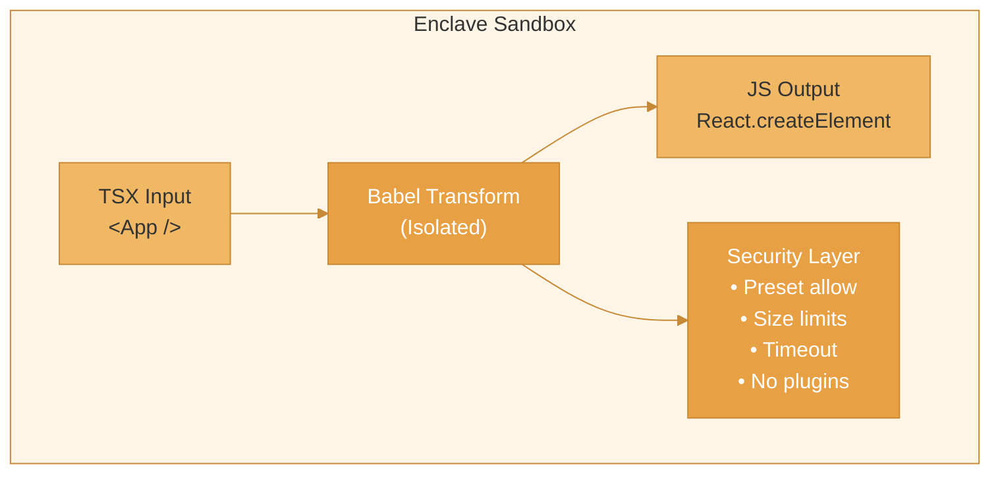

The Babel transform feature enables secure TSX/JSX transformation inside the enclave sandbox. This allows LLM-generated React components to be compiled to JavaScript safely, without exposing the host system to code execution risks.

## Overview



## Quick Start

```ts
import { Enclave } from '@enclave-vm/core';

// Create enclave with babel preset
const enclave = new Enclave({
  preset: 'babel',
  securityLevel: 'STANDARD',
});

// Transform TSX inside the sandbox
const result = await enclave.run(`
  const tsx = \`
    interface Props { name: string; }
    const Greeting = ({ name }: Props) => <h1>Hello, {name}!</h1>;
  \`;

  const transformed = Babel.transform(tsx, {
    presets: ['typescript', 'react'],
    filename: 'Greeting.tsx',
  });

  return transformed.code;
`);

console.log(result.value);
// Output: const Greeting = ({ name }) => /*#__PURE__*/React.createElement("h1", null, "Hello, ", name, "!");

enclave.dispose();
```

## Security Model

The Babel transform runs in an isolated VM context with multiple security layers:

| Layer | Protection | Description |
|-------|------------|-------------|
| **Preset Whitelist** | Controlled transforms | Only allowed presets can be used (no arbitrary plugins) |
| **Input Size Limit** | DoS prevention | Maximum source code size varies by security level |
| **Output Size Limit** | Memory protection | Prevents output expansion attacks |
| **Transform Timeout** | Resource control | Prevents infinite compilation loops |
| **Isolated Context** | Sandbox escape | Babel runs without access to fs, process, require |
| **No Plugins** | Code execution | Plugins are completely blocked (they execute arbitrary code) |

## Configuration

### Security Levels

Each security level provides different limits for Babel transforms:

| Security Level | Max Input | Max Output | Timeout | Allowed Presets |
|----------------|-----------|------------|---------|-----------------|
| `STRICT` | 100 KB | 500 KB | 5s | `react` only |
| `SECURE` | 500 KB | 2 MB | 10s | `typescript`, `react` |
| `STANDARD` | 1 MB | 5 MB | 15s | `typescript`, `react` |
| `PERMISSIVE` | 5 MB | 25 MB | 30s | `typescript`, `react`, `env` |

```ts
import { Enclave } from '@enclave-vm/core';
import { getBabelConfig } from '@enclave-vm/ast';

// Get config for a security level
const config = getBabelConfig('SECURE');
console.log(config);
// {
//   maxInputSize: 524288,     // 500 KB
//   maxOutputSize: 2097152,   // 2 MB
//   transformTimeout: 10000,  // 10 seconds
//   allowedPresets: ['typescript', 'react']
// }
```

### Creating a Babel Enclave

```ts
const enclave = new Enclave({
  preset: 'babel',           // Enable Babel preset
  securityLevel: 'STANDARD', // Choose security level
});
```

## Transform API

Inside the enclave, the `Babel` global provides a restricted transform API:

```ts
interface SafeTransformOptions {
  filename?: string;                    // For error messages (sanitized)
  presets?: string[];                   // Must be in allowed list
  sourceType?: 'module' | 'script';     // Default: 'module'
}

interface SafeTransformResult {
  code: string;                         // Transformed JavaScript
}

// Usage inside enclave
const result = Babel.transform(code, options);
```

### Transform Options

| Option | Type | Default | Description |
|--------|------|---------|-------------|
| `filename` | `string` | `'input.tsx'` | Filename for error messages |
| `presets` | `string[]` | `[]` | Babel presets to apply |
| `sourceType` | `'module' \| 'script'` | `'module'` | How to parse the code |

<Warning>
  The following Babel options are **blocked** for security:
  - `plugins` - Completely blocked (execute arbitrary code)
  - `sourceMaps` - Blocked (path leakage)
  - `ast` - Blocked (not needed, reduces attack surface)
  - `babelrc` / `configFile` - Blocked (no file system access)
</Warning>

## Common Use Cases

### Transform React Components

```ts
const code = `
  const tsx = \`
    const Button = ({ onClick, children }) => (
      <button className="btn" onClick={onClick}>
        {children}
      </button>
    );
  \`;

  return Babel.transform(tsx, {
    presets: ['react'],
    filename: 'Button.jsx',
  }).code;
`;

const result = await enclave.run(code);
// Result: React.createElement("button", { className: "btn", onClick }, children)
```

### Transform TypeScript + JSX

```ts
const code = `
  const tsx = \`
    interface UserCardProps {
      user: { name: string; email: string; };
      onEdit?: () => void;
    }

    const UserCard = ({ user, onEdit }: UserCardProps) => (
      <div className="user-card">
        <h2>{user.name}</h2>
        <p>{user.email}</p>
        {onEdit && <button onClick={onEdit}>Edit</button>}
      </div>
    );
  \`;

  return Babel.transform(tsx, {
    presets: ['typescript', 'react'],
    filename: 'UserCard.tsx',
  }).code;
`;

const result = await enclave.run(code);
// TypeScript types are stripped, JSX is transformed
```

### Tool Integration for Dynamic Components

```ts
const enclave = new Enclave({
  preset: 'babel',
  securityLevel: 'STANDARD',
  toolHandler: async (toolName, args) => {
    if (toolName === 'component:fetch') {
      // Fetch TSX from database, API, or LLM
      return `<Card title="${args.title}"><p>Content</p></Card>`;
    }
    return null;
  },
});

const code = `
  // Fetch component TSX from external source
  const tsx = await callTool('component:fetch', { title: 'Welcome' });

  // Transform to JavaScript
  const js = Babel.transform(tsx, {
    presets: ['react'],
    filename: 'Card.jsx',
  }).code;

  return js;
`;

const result = await enclave.run(code);
```

## Error Handling

Babel transform errors are sanitized to prevent path leakage:

```ts
const code = `
  try {
    // Invalid JSX
    Babel.transform('<div', { presets: ['react'] });
  } catch (error) {
    return error.message;
  }
`;

const result = await enclave.run(code);
// Error message shows line/column but no file paths
```

### Common Errors

| Error | Cause | Solution |
|-------|-------|----------|
| `Preset "X" is not allowed` | Using disallowed preset | Use preset from allowed list |
| `Code exceeds maximum size` | Input too large | Reduce input or use higher security level |
| `Output exceeds maximum size` | Transform produced too much output | Simplify input code |
| `Transform timed out` | Compilation taking too long | Simplify code or increase timeout |
| `Code contains invalid null bytes` | Malicious input | Clean input before transform |

## Performance

Babel transforms are optimized with context caching:

| Operation | Typical Latency | Throughput |
|-----------|----------------|------------|
| Simple component (L1) | ~0.6ms | 1400+ transforms/sec |
| Props + types (L2) | ~0.9ms | 1100+ transforms/sec |
| Styled components (L3) | ~0.8ms | 1200+ transforms/sec |
| Composite patterns (L4) | ~1.2ms | 700+ transforms/sec |
| Complex TypeScript (L5) | ~2.2ms | 350+ transforms/sec |

<Tip>
  The Babel context is cached between transforms. The first transform (cold start) takes ~20-50ms, subsequent transforms are much faster.
</Tip>

### Performance Tips

1. **Batch transforms** - Transform multiple components in a single enclave run
2. **Reuse enclave** - Don't create/dispose for each transform
3. **Minimize types** - Complex TypeScript types increase transform time
4. **Use STANDARD level** - Good balance of security and performance

```ts
// Good: Reuse enclave for multiple transforms
const enclave = new Enclave({ preset: 'babel' });

const components = ['Button', 'Card', 'Modal'];
const results = await enclave.run(`
  const components = ${JSON.stringify(componentCode)};
  return components.map(tsx =>
    Babel.transform(tsx, { presets: ['react'] }).code
  );
`);

enclave.dispose();
```

## Direct API (Outside Enclave)

For server-side use without the full enclave sandbox, use `createRestrictedBabel`:

```ts
import { createRestrictedBabel } from '@enclave-vm/core';
import { getBabelConfig } from '@enclave-vm/ast';

const config = getBabelConfig('STANDARD');
const babel = createRestrictedBabel(config);

const result = babel.transform(tsxCode, {
  presets: ['typescript', 'react'],
  filename: 'Component.tsx',
});

console.log(result.code);
```

<Warning>
  The direct API still runs Babel in an isolated VM context, but doesn't provide the full enclave sandbox features (tool calls, iteration limits, etc.). Use the full enclave for LLM-generated code.
</Warning>

## Related

- [Overview](/core-libraries/enclave-vm/overview) - Enclave introduction
- [Security Levels](/core-libraries/enclave-vm/security-levels) - Security profiles
- [AgentScript Preset](/core-libraries/ast-guard/agentscript-preset) - AST validation for enclave code
- [Tool System](/core-libraries/enclave-vm/tool-system) - Integrating tools with enclave
