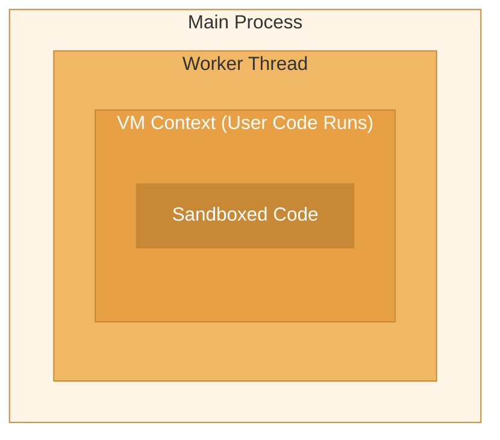

For OS-level memory isolation, use the worker threads adapter. This provides stronger isolation than the default VM context by running code in separate Node.js worker threads.

## Basic Usage

```ts
import { Enclave } from '@enclave-vm/core';

const enclave = new Enclave({
  adapter: 'worker_threads',
  workerPoolConfig: {
    minWorkers: 2,
    maxWorkers: 8,
    memoryLimitPerWorker: 256 * 1024 * 1024, // 256MB
  },
});
```

## Worker Pool Features

- **Pool management** - Auto-scaling with min/max workers
- **Memory monitoring** - Workers recycled when exceeding limits
- **Hard halt** - Force terminate via `worker.terminate()`
- **Rate limiting** - Message flood protection
- **Dual-layer sandbox** - Worker thread + VM context isolation

## Worker Pool Presets

| Setting                | STRICT | SECURE | STANDARD | PERMISSIVE |
| ---------------------- | ------ | ------ | -------- | ---------- |
| maxWorkers             | 4      | 8      | 16       | 32         |
| memoryLimitPerWorker   | 64MB   | 128MB  | 256MB    | 512MB      |
| maxExecutionsPerWorker | 100    | 500    | 1,000    | 5,000      |
| maxQueueSize           | 20     | 50     | 100      | 500        |
| maxMessagesPerSecond   | 100    | 500    | 1,000    | 5,000      |

## Using Presets

```ts
import { Enclave, WorkerPoolPresets } from '@enclave-vm/core';

// Use STRICT preset for maximum isolation
const enclave = new Enclave({
  adapter: 'worker_threads',
  workerPoolConfig: WorkerPoolPresets.STRICT,
});

// Or customize from a preset
const customEnclave = new Enclave({
  adapter: 'worker_threads',
  workerPoolConfig: {
    ...WorkerPoolPresets.SECURE,
    maxWorkers: 16, // Override specific setting
  },
});
```

## Configuration Options

```ts
interface WorkerPoolConfig {
  // Pool sizing
  minWorkers: number;        // Minimum workers to keep warm
  maxWorkers: number;        // Maximum concurrent workers

  // Resource limits
  memoryLimitPerWorker: number;  // Memory limit per worker (bytes)
  maxExecutionsPerWorker: number; // Executions before worker recycle

  // Queue management
  maxQueueSize: number;      // Maximum pending executions
  queueTimeout: number;      // Queue wait timeout (ms)

  // Rate limiting
  maxMessagesPerSecond: number;  // Message flood protection

  // Lifecycle
  idleTimeout: number;       // Time before idle worker shutdown
  gracefulShutdownTimeout: number; // Shutdown wait time
}
```

## Memory Isolation Benefits

Worker threads provide stronger isolation than VM contexts alone:

1. **Separate V8 heap** - Each worker has its own memory space
2. **Hard memory limits** - OS-level enforcement via `--max-old-space-size`
3. **Process-like isolation** - Worker crash doesn't affect main process
4. **Clean termination** - `worker.terminate()` guarantees cleanup

## When to Use Worker Pool

Use the worker pool adapter when:

- Running code from completely untrusted sources
- Memory isolation is critical
- You need hard termination guarantees
- Processing many concurrent executions

Use the default VM adapter when:

- Memory isolation is less critical
- You need lower latency
- Running trusted or semi-trusted code
- Simpler deployment is preferred

## Dual-Layer Sandbox

The worker pool provides two layers of isolation:



1. **Worker Thread** - OS-level process isolation
2. **VM Context** - JavaScript-level sandboxing

## Monitoring Worker Health

```ts
const enclave = new Enclave({
  adapter: 'worker_threads',
  workerPoolConfig: {
    maxWorkers: 8,
    memoryLimitPerWorker: 256 * 1024 * 1024,

    // Callback when worker is recycled
    onWorkerRecycled: (reason) => {
      console.log('Worker recycled:', reason);
    },

    // Callback for pool stats
    onStatsUpdate: (stats) => {
      console.log('Active workers:', stats.activeWorkers);
      console.log('Queue depth:', stats.queueDepth);
    },
  },
});
```

## Related

- [Security Levels](/core-libraries/enclave-vm/security-levels) - Security presets
- [Double VM](/core-libraries/enclave-vm/double-vm) - Additional security layer
- [Configuration](/core-libraries/enclave-vm/configuration) - All configuration options
