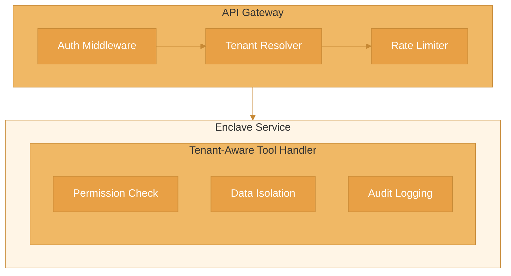

Implement secure, isolated code execution for multiple users or tenants.

## Architecture



## Tenant Context

```ts
interface TenantContext {
  tenantId: string;
  userId: string;
  permissions: string[];
  quotas: {
    maxExecutions: number;
    maxToolCalls: number;
    maxDurationMs: number;
  };
}

// Extract from request
function getTenantContext(req: Request): TenantContext {
  const token = req.headers.authorization?.replace('Bearer ', '');
  const decoded = verifyToken(token);

  return {
    tenantId: decoded.tenantId,
    userId: decoded.userId,
    permissions: decoded.permissions,
    quotas: getTenantQuotas(decoded.tenantId),
  };
}
```

## Tenant-Isolated Enclave

```ts
import { Enclave } from '@enclave-vm/core';

class TenantEnclaveService {
  private enclave: Enclave;

  constructor() {
    this.enclave = new Enclave({
      securityLevel: 'STRICT',
      toolHandler: this.createTenantToolHandler.bind(this),
    });
  }

  async execute(code: string, context: TenantContext) {
    // Apply tenant-specific limits
    const result = await this.enclave.run(code, {
      timeout: context.quotas.maxDurationMs,
      maxToolCalls: context.quotas.maxToolCalls,
      context, // Pass to tool handler
    });

    // Log execution for audit
    await this.logExecution(context, code, result);

    return result;
  }

  private createTenantToolHandler(context: TenantContext) {
    return async (name: string, args: Record<string, unknown>) => {
      // Check permission
      const permission = `tool:${name}`;
      if (!context.permissions.includes(permission)) {
        throw new Error(`Permission denied: ${permission}`);
      }

      // Execute with tenant isolation
      return this.executeTenantTool(context, name, args);
    };
  }

  private async executeTenantTool(
    context: TenantContext,
    name: string,
    args: Record<string, unknown>
  ) {
    // Add tenant filter to all queries
    const tenantArgs = {
      ...args,
      _tenantId: context.tenantId,
    };

    switch (name) {
      case 'data:query':
        return db.collection('data')
          .find({ ...args.filter, tenantId: context.tenantId })
          .limit(args.limit || 100)
          .toArray();

      case 'data:insert':
        return db.collection('data').insertOne({
          ...args.document,
          tenantId: context.tenantId,
          createdBy: context.userId,
          createdAt: new Date(),
        });

      default:
        throw new Error(`Unknown tool: ${name}`);
    }
  }

  private async logExecution(
    context: TenantContext,
    code: string,
    result: ExecutionResult
  ) {
    await auditLog.insert({
      tenantId: context.tenantId,
      userId: context.userId,
      action: 'code_execution',
      codeHash: hash(code),
      success: result.success,
      duration: result.stats?.duration,
      timestamp: new Date(),
    });
  }
}
```

## API Endpoints

```ts
import express from 'express';
import { TenantEnclaveService } from './services/enclave';

const app = express();
const enclaveService = new TenantEnclaveService();

// Middleware
app.use(authMiddleware);
app.use(tenantMiddleware);
app.use(rateLimitMiddleware);

// Execute endpoint
app.post('/api/execute', async (req, res) => {
  const context = req.tenantContext as TenantContext;
  const { code } = req.body;

  // Check execution quota
  const executions = await getExecutionCount(context.tenantId, 'day');
  if (executions >= context.quotas.maxExecutions) {
    return res.status(429).json({
      error: 'Execution quota exceeded',
      limit: context.quotas.maxExecutions,
      reset: getNextResetTime(),
    });
  }

  try {
    const result = await enclaveService.execute(code, context);
    res.json(result);
  } catch (error) {
    res.status(500).json({
      error: error.message,
    });
  }
});

// Get tenant usage
app.get('/api/usage', async (req, res) => {
  const context = req.tenantContext as TenantContext;

  const usage = await getUsageStats(context.tenantId);
  res.json({
    executions: usage.executionCount,
    toolCalls: usage.toolCallCount,
    quotas: context.quotas,
    periodEnd: getNextResetTime(),
  });
});
```

## Per-Tenant Tool Registration

```ts
interface TenantToolConfig {
  tenantId: string;
  tools: Array<{
    name: string;
    enabled: boolean;
    rateLimit?: { calls: number; windowMs: number };
    config?: Record<string, unknown>;
  }>;
}

class TenantToolRegistry {
  private configs = new Map<string, TenantToolConfig>();

  async loadTenantConfig(tenantId: string): Promise<TenantToolConfig> {
    if (this.configs.has(tenantId)) {
      return this.configs.get(tenantId)!;
    }

    const config = await db.collection('tenant_tools').findOne({ tenantId });
    this.configs.set(tenantId, config);
    return config;
  }

  async isToolEnabled(tenantId: string, toolName: string): Promise<boolean> {
    const config = await this.loadTenantConfig(tenantId);
    const tool = config.tools.find(t => t.name === toolName);
    return tool?.enabled ?? false;
  }

  async getToolConfig(
    tenantId: string,
    toolName: string
  ): Promise<Record<string, unknown> | undefined> {
    const config = await this.loadTenantConfig(tenantId);
    const tool = config.tools.find(t => t.name === toolName);
    return tool?.config;
  }
}
```

## Data Isolation

```ts
// Ensure all database queries include tenant filter
class TenantDataAccess {
  constructor(private tenantId: string) {}

  async find(collection: string, filter: object) {
    return db.collection(collection).find({
      ...filter,
      tenantId: this.tenantId, // Always filter by tenant
    });
  }

  async insert(collection: string, document: object) {
    return db.collection(collection).insertOne({
      ...document,
      tenantId: this.tenantId,
    });
  }

  async update(collection: string, filter: object, update: object) {
    return db.collection(collection).updateMany(
      { ...filter, tenantId: this.tenantId },
      update
    );
  }

  async delete(collection: string, filter: object) {
    return db.collection(collection).deleteMany({
      ...filter,
      tenantId: this.tenantId,
    });
  }
}
```

## Resource Quotas

```ts
interface TenantQuotas {
  // Execution limits
  maxExecutionsPerDay: number;
  maxExecutionDurationMs: number;
  maxConcurrentExecutions: number;

  // Tool limits
  maxToolCallsPerExecution: number;
  maxToolCallsPerDay: number;

  // Resource limits
  maxMemoryMB: number;
  maxCodeSizeKB: number;
  maxOutputSizeKB: number;
}

const TIER_QUOTAS: Record<string, TenantQuotas> = {
  free: {
    maxExecutionsPerDay: 100,
    maxExecutionDurationMs: 5000,
    maxConcurrentExecutions: 1,
    maxToolCallsPerExecution: 10,
    maxToolCallsPerDay: 500,
    maxMemoryMB: 32,
    maxCodeSizeKB: 50,
    maxOutputSizeKB: 100,
  },
  starter: {
    maxExecutionsPerDay: 1000,
    maxExecutionDurationMs: 30000,
    maxConcurrentExecutions: 5,
    maxToolCallsPerExecution: 50,
    maxToolCallsPerDay: 10000,
    maxMemoryMB: 64,
    maxCodeSizeKB: 100,
    maxOutputSizeKB: 500,
  },
  enterprise: {
    maxExecutionsPerDay: 100000,
    maxExecutionDurationMs: 300000,
    maxConcurrentExecutions: 100,
    maxToolCallsPerExecution: 500,
    maxToolCallsPerDay: 1000000,
    maxMemoryMB: 256,
    maxCodeSizeKB: 500,
    maxOutputSizeKB: 5000,
  },
};

async function getTenantQuotas(tenantId: string): Promise<TenantQuotas> {
  const tenant = await db.collection('tenants').findOne({ id: tenantId });
  const tier = tenant?.tier || 'free';
  return TIER_QUOTAS[tier];
}
```

## Rate Limiting per Tenant

```ts
import { RateLimiterRedis } from 'rate-limiter-flexible';

const rateLimiters = {
  execution: new RateLimiterRedis({
    storeClient: redis,
    keyPrefix: 'rl:exec',
    points: 100,
    duration: 86400, // per day
  }),
  toolCall: new RateLimiterRedis({
    storeClient: redis,
    keyPrefix: 'rl:tool',
    points: 10000,
    duration: 86400,
  }),
};

async function checkRateLimit(
  limiter: string,
  tenantId: string,
  points = 1
): Promise<void> {
  const rl = rateLimiters[limiter];
  if (!rl) throw new Error(`Unknown limiter: ${limiter}`);

  try {
    await rl.consume(tenantId, points);
  } catch (error) {
    throw new Error(`Rate limit exceeded: ${limiter}`);
  }
}
```

## Tenant Isolation Testing

```ts
import { describe, it, expect } from 'vitest';
import { TenantEnclaveService } from './services/enclave';

describe('Tenant Isolation', () => {
  const service = new TenantEnclaveService();

  const tenant1 = {
    tenantId: 'tenant-1',
    userId: 'user-1',
    permissions: ['tool:data:query', 'tool:data:insert'],
    quotas: { maxExecutions: 100, maxToolCalls: 50, maxDurationMs: 5000 },
  };

  const tenant2 = {
    tenantId: 'tenant-2',
    userId: 'user-2',
    permissions: ['tool:data:query'],
    quotas: { maxExecutions: 100, maxToolCalls: 50, maxDurationMs: 5000 },
  };

  it('isolates data between tenants', async () => {
    // Tenant 1 inserts data
    await service.execute(`
      await callTool('data:insert', { document: { name: 'secret' } });
    `, tenant1);

    // Tenant 2 queries - should not see tenant 1 data
    const result = await service.execute(`
      const items = await callTool('data:query', { filter: {} });
      return items;
    `, tenant2);

    expect(result.value).toEqual([]);
  });

  it('enforces tool permissions', async () => {
    // Tenant 2 doesn't have insert permission
    const result = await service.execute(`
      await callTool('data:insert', { document: { name: 'test' } });
    `, tenant2);

    expect(result.success).toBe(false);
    expect(result.error?.message).toContain('Permission denied');
  });

  it('enforces quotas', async () => {
    const limitedContext = {
      ...tenant1,
      quotas: { ...tenant1.quotas, maxToolCalls: 2 },
    };

    const result = await service.execute(`
      await callTool('data:query', {});
      await callTool('data:query', {});
      await callTool('data:query', {}); // Should fail
    `, limitedContext);

    expect(result.success).toBe(false);
    expect(result.error?.code).toBe('MAX_TOOL_CALLS');
  });
});
```

## Complete Example

```ts
// server.ts
import express from 'express';
import { Enclave } from '@enclave-vm/core';

const app = express();
app.use(express.json());

// Tenant context middleware
app.use(async (req, res, next) => {
  const token = req.headers.authorization?.replace('Bearer ', '');
  if (!token) {
    return res.status(401).json({ error: 'Unauthorized' });
  }

  try {
    const decoded = verifyToken(token);
    req.tenant = {
      tenantId: decoded.tenantId,
      userId: decoded.userId,
      permissions: decoded.permissions,
      quotas: await getTenantQuotas(decoded.tenantId),
    };
    next();
  } catch {
    res.status(401).json({ error: 'Invalid token' });
  }
});

// Execute endpoint
app.post('/execute', async (req, res) => {
  const { code } = req.body;
  const tenant = req.tenant;

  // Check execution quota
  await checkRateLimit('execution', tenant.tenantId);

  // Create tenant-specific enclave
  const enclave = new Enclave({
    securityLevel: 'STRICT',
    timeout: tenant.quotas.maxDurationMs,
    maxToolCalls: tenant.quotas.maxToolCalls,
    memoryLimit: tenant.quotas.maxMemoryMB * 1024 * 1024,

    toolHandler: async (name, args) => {
      // Check permission
      if (!tenant.permissions.includes(`tool:${name}`)) {
        throw new Error(`Permission denied: tool:${name}`);
      }

      // Check tool rate limit
      await checkRateLimit('toolCall', tenant.tenantId);

      // Execute with tenant isolation
      return executeTenantTool(tenant, name, args);
    },
  });

  try {
    const result = await enclave.run(code);

    // Audit log
    await logExecution(tenant, code, result);

    res.json(result);
  } finally {
    enclave.dispose();
  }
});

app.listen(3000);
```

## Next Steps

- [Encrypted Sessions](/examples/encrypted-sessions) - E2E encryption
- [Security Hardening](/guides/security-hardening) - Security best practices
- [Scaling](/guides/scaling) - Scale multi-tenant deployments
