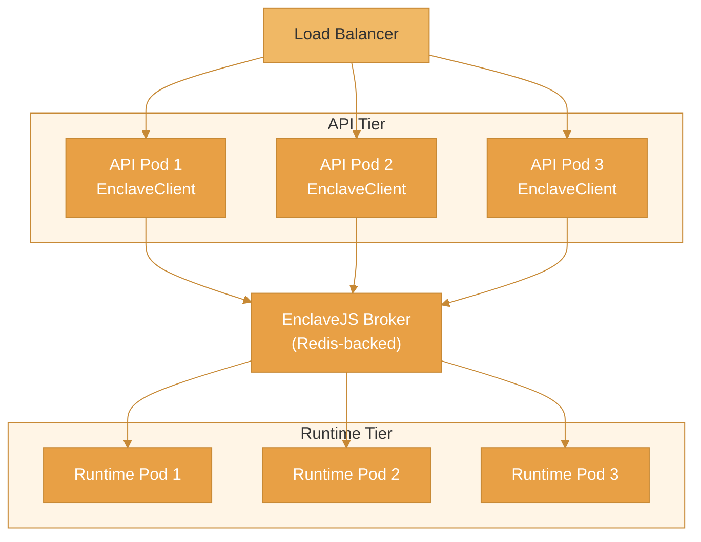

This guide covers scaling Enclave for high-throughput workloads, from single-server optimization to distributed multi-pod deployments.

## Scaling Dimensions

| Dimension | Single Server | Distributed |
|-----------|---------------|-------------|
| Concurrency | Worker pool | Multiple runtime pods |
| Sessions | In-memory | Redis-backed |
| Tool execution | Local | Distributed via broker |
| State | Process memory | Redis/external store |

## Single-Server Scaling

### Worker Pool

For CPU-bound workloads, use the worker pool adapter:

```ts
import { Enclave, createWorkerPoolAdapter } from '@enclave-vm/core';

const enclave = new Enclave({
  adapter: createWorkerPoolAdapter({
    // Number of worker processes
    poolSize: 4,

    // Memory limit per worker
    maxWorkerMemory: 128 * 1024 * 1024, // 128MB

    // Restart workers after N executions (memory leak prevention)
    maxExecutionsPerWorker: 1000,

    // Worker idle timeout
    idleTimeout: 60000,
  }),

  toolHandler: async (name, args) => {
    return executeTool(name, args);
  },
});
```

### Pool Sizing Guidelines

| Workload Type | Recommended Pool Size |
|---------------|----------------------|
| CPU-heavy scripts | CPU cores |
| I/O-heavy (tool calls) | CPU cores × 2 |
| Mixed | CPU cores × 1.5 |

```ts
import os from 'os';

const cpuCount = os.cpus().length;
const poolSize = Math.max(2, Math.floor(cpuCount * 1.5));
```

### Enclave Pooling

Reuse Enclave instances to avoid initialization overhead:

```ts
class EnclavePool {
  private pool: Enclave[] = [];
  private available: Set<Enclave> = new Set();
  private waiters: ((enclave: Enclave) => void)[] = [];

  constructor(
    private size: number,
    private config: EnclaveConfig
  ) {
    for (let i = 0; i < size; i++) {
      const enclave = new Enclave(config);
      this.pool.push(enclave);
      this.available.add(enclave);
    }
  }

  async acquire(): Promise<Enclave> {
    // Try to get an available instance
    for (const enclave of this.available) {
      this.available.delete(enclave);
      return enclave;
    }

    // Wait for one to become available
    return new Promise((resolve) => {
      this.waiters.push(resolve);
    });
  }

  release(enclave: Enclave) {
    if (this.waiters.length > 0) {
      const waiter = this.waiters.shift()!;
      waiter(enclave);
    } else {
      this.available.add(enclave);
    }
  }

  async execute(code: string): Promise<ExecutionResult> {
    const enclave = await this.acquire();
    try {
      return await enclave.run(code);
    } finally {
      this.release(enclave);
    }
  }

  dispose() {
    this.pool.forEach(e => e.dispose());
    this.pool = [];
    this.available.clear();
  }
}
```

## Distributed Scaling

### Architecture



### Broker Configuration

```ts
// broker/server.ts
import { EnclaveBroker } from '@enclave-vm/broker';
import Redis from 'ioredis';

const redis = new Redis(process.env.REDIS_URL);

const broker = new EnclaveBroker({
  // Redis for session state
  redis,

  // Tool registry
  tools: toolRegistry,

  // Session limits
  maxConcurrentSessions: 1000,
  sessionTimeout: 300000, // 5 minutes

  // Runtime pool management
  runtimePool: {
    minSize: 2,
    maxSize: 10,
    scaleUpThreshold: 0.8, // Scale up at 80% utilization
    scaleDownThreshold: 0.3, // Scale down at 30% utilization
    scaleInterval: 30000, // Check every 30 seconds
  },
});

broker.listen(3001);
```

### Runtime Configuration

```ts
// runtime/server.ts
import { EnclaveRuntime } from '@enclave-vm/runtime';

const runtime = new EnclaveRuntime({
  // Connect to broker
  brokerUrl: process.env.BROKER_URL,

  // Worker configuration
  workerPool: {
    size: 4,
    maxMemory: 128 * 1024 * 1024,
  },

  // Heartbeat
  heartbeatInterval: 5000,

  // Labels for routing
  labels: {
    region: process.env.REGION,
    tier: 'standard',
  },
});

runtime.connect();
```

### Client Configuration

```ts
// api/client.ts
import { EnclaveClient } from '@enclave-vm/client';

const client = new EnclaveClient({
  serverUrl: process.env.BROKER_URL,

  // Reconnection
  reconnection: {
    enabled: true,
    maxAttempts: 5,
    backoffMultiplier: 2,
  },

  // Request timeout
  timeout: 60000,
});
```

## Redis Configuration

### Session State

```ts
// Redis key structure
// session:{sessionId} - Session metadata
// session:{sessionId}:events - Event stream
// session:{sessionId}:tools - Pending tool calls

const redis = new Redis({
  host: process.env.REDIS_HOST,
  port: parseInt(process.env.REDIS_PORT || '6379'),
  password: process.env.REDIS_PASSWORD,

  // Connection pool
  maxRetriesPerRequest: 3,
  enableReadyCheck: true,
  lazyConnect: true,

  // Cluster mode (if using Redis Cluster)
  // cluster: [{ host: 'node1', port: 6379 }],
});
```

### Redis Cluster

For high availability:

```ts
import Redis from 'ioredis';

const redis = new Redis.Cluster([
  { host: 'redis-node-1', port: 6379 },
  { host: 'redis-node-2', port: 6379 },
  { host: 'redis-node-3', port: 6379 },
], {
  redisOptions: {
    password: process.env.REDIS_PASSWORD,
  },
  scaleReads: 'slave', // Read from replicas
});
```

## Kubernetes Scaling

### Horizontal Pod Autoscaler

```yaml
# hpa.yaml
apiVersion: autoscaling/v2
kind: HorizontalPodAutoscaler
metadata:
  name: enclave-runtime-hpa
spec:
  scaleTargetRef:
    apiVersion: apps/v1
    kind: Deployment
    name: enclave-runtime
  minReplicas: 2
  maxReplicas: 20
  metrics:
    - type: Resource
      resource:
        name: cpu
        target:
          type: Utilization
          averageUtilization: 70
    - type: Pods
      pods:
        metric:
          name: enclave_active_executions
        target:
          type: AverageValue
          averageValue: 10
```

### Pod Disruption Budget

```yaml
# pdb.yaml
apiVersion: policy/v1
kind: PodDisruptionBudget
metadata:
  name: enclave-runtime-pdb
spec:
  minAvailable: 2
  selector:
    matchLabels:
      app: enclave-runtime
```

### Resource Quotas

```yaml
# quota.yaml
apiVersion: v1
kind: ResourceQuota
metadata:
  name: enclave-quota
spec:
  hard:
    requests.cpu: "20"
    requests.memory: 40Gi
    limits.cpu: "40"
    limits.memory: 80Gi
    pods: "50"
```

## Load Balancing

### Sticky Sessions

For WebSocket connections:

```yaml
# ingress.yaml
apiVersion: networking.k8s.io/v1
kind: Ingress
metadata:
  name: enclave-broker
  annotations:
    nginx.ingress.kubernetes.io/affinity: "cookie"
    nginx.ingress.kubernetes.io/session-cookie-name: "enclave-session"
    nginx.ingress.kubernetes.io/session-cookie-max-age: "3600"
```

### Runtime Routing

Route to specific runtimes based on workload:

```ts
const broker = new EnclaveBroker({
  // Route by labels
  routingStrategy: 'label-match',

  // Routing rules
  routingRules: [
    {
      match: { priority: 'high' },
      target: { tier: 'premium' },
    },
    {
      match: { region: 'us-east' },
      target: { region: 'us-east' },
    },
  ],
});
```

## Performance Benchmarks

### Single Server (8 cores, 16GB RAM)

| Metric | Value |
|--------|-------|
| Simple scripts | 500 req/s |
| With tool calls | 200 req/s |
| P50 latency | 15ms |
| P99 latency | 85ms |

### Distributed (3 runtime pods)

| Metric | Value |
|--------|-------|
| Simple scripts | 1200 req/s |
| With tool calls | 500 req/s |
| P50 latency | 25ms |
| P99 latency | 120ms |

## Monitoring at Scale

### Key Metrics

```ts
// Prometheus metrics
const metrics = {
  // Throughput
  executionsPerSecond: new Counter({
    name: 'enclave_executions_per_second',
    help: 'Executions per second',
  }),

  // Latency
  executionLatency: new Histogram({
    name: 'enclave_execution_latency_seconds',
    help: 'Execution latency in seconds',
    buckets: [0.01, 0.05, 0.1, 0.25, 0.5, 1, 2.5, 5, 10],
  }),

  // Queue depth
  queueDepth: new Gauge({
    name: 'enclave_queue_depth',
    help: 'Number of pending executions',
    labelNames: ['runtime'],
  }),

  // Runtime health
  runtimeHealth: new Gauge({
    name: 'enclave_runtime_health',
    help: 'Runtime health status (1=healthy, 0=unhealthy)',
    labelNames: ['runtime_id'],
  }),

  // Memory usage
  workerMemory: new Gauge({
    name: 'enclave_worker_memory_bytes',
    help: 'Worker memory usage in bytes',
    labelNames: ['worker_id'],
  }),
};
```

### Alerting Rules

```yaml
# prometheus-rules.yaml
groups:
  - name: enclave
    rules:
      - alert: HighExecutionLatency
        expr: histogram_quantile(0.99, enclave_execution_latency_seconds) > 5
        for: 5m
        labels:
          severity: warning
        annotations:
          summary: High execution latency detected

      - alert: QueueBacklog
        expr: enclave_queue_depth > 100
        for: 2m
        labels:
          severity: critical
        annotations:
          summary: Execution queue backlog

      - alert: RuntimeUnhealthy
        expr: enclave_runtime_health == 0
        for: 1m
        labels:
          severity: critical
        annotations:
          summary: Runtime pod unhealthy
```

## Best Practices

1. **Start simple** - Use worker pool before going distributed
2. **Monitor queue depth** - Scale based on pending executions
3. **Set memory limits** - Prevent runaway scripts
4. **Use connection pooling** - Reuse Redis/DB connections
5. **Implement backpressure** - Reject requests when overloaded
6. **Regional deployment** - Deploy runtimes close to users
7. **Graceful degradation** - Fallback when components fail

## Related

- [Production Deployment](/guides/production-deployment) - Deployment guide
- [Worker Pool](/core-libraries/enclave-vm/worker-pool) - Worker pool details
- [EnclaveJS Broker](/enclavejs/broker) - Broker configuration
